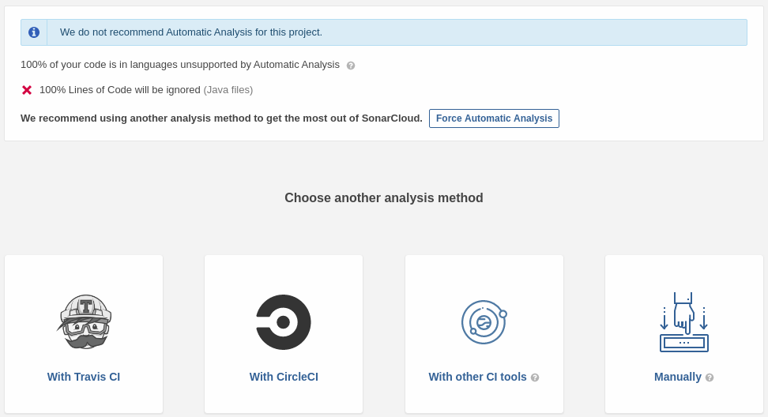

# Java Project on GitHub with CircleCI

It is always a good idea to run project tests before merging into production branch (`master`). There are a lot of CI/CD machineries to choose from ([CircleCI](https://circleci.com/), [Travis](https://travis-ci.com/), [GitLab](https://gitlab.com/), etc.). In this short guide a simple setup for the CircleCI pipelines will be presented.

### Setting Up CircleCI YAML Config file

* Sign up or log in to [CircleCI](https://circleci.com/) with your GitHub account.
* You will be presented with a dialog to select or create an organization.


* A project list should show up. On that project list choose a project you would like to create a pipeline for. Click on _Set Up Project_ blue button next to that project.


* You will be presented with an editor with a stub YAML config file. Choose your project's language and a build tool to generate a stab of YAML file. In _Example YAML config file_ section is an example for Maven project.


* Click on _Add Config_ blue button to create a Push Request in you GitHub project.
   * If that dosn't work then add the file manually to your repository.
   * If you click on _Start Building_ blue button before you create the Pull Request, the first pipeline run will fail, since there is no `.circleci/config.yml` file in your repository just yet.
   * Commit and push to a branch checkedout from the `master` branch and create a Pull Request with YAML config file in GitHub.
   * If you didn't click on _Start Building_ blue button yet, then the Pull Request will not trigger a pipeline run. Click on that button and retrigger a pipeline run (e.g. with an empty commit into the Pull Request).


* If everything is ok, you should see an additional check in the Pull Request, next to mergability check.


* Work out all the issues before merging into `master` branch.
* After merge into `master` branch additional pipeline runs against merged code in the `master` branch. After it finishes a green check icon is showned on the home page of your repo.


* It is possible to use CircleCI's status badges in a `README.md` file. These badges will be updated after each run according to a pipeline's result. Follow [this link (Adding Status Badges)](https://circleci.com/docs/2.0/status-badges/) for info how to set them up.

### Example YAML config file

```yaml
version: 2.1

jobs:
  build:
    docker:
      - image: 'circleci/openjdk:11-jdk'

    working_directory: ~/repo

    environment:
      MAVEN_OPTS: -Xmx3200m  # Customize the JVM maximum heap limit

    steps:
      - checkout
      
      - restore_cache:  # Download and cache dependencies
          keys:
            - v1-dependencies-{{ checksum "pom.xml" }}
            - v1-dependencies-

      - run: mvn install dependency:go-offline -Dmaven.test.skip=true

      - save_cache:
          paths:
            - ~/.m2
          key: v1-dependencies-{{ checksum "pom.xml" }}

      - run: mvn integration-test # run tests!
```

# Java Project on GitHub with CircleCI and SonarCloud

Code quality is a good idea if you'd like to avoid some bugs before they arrive and have a maintenaible code. [SonarCloud](https://sonarcloud.io) can do that for your GitHub projects if you already have a CI/CD set up. In this short guide a simple setup for SonarCloud with CircleCI will be presented.

### Setting it up

* Sing up or log in to [SonarCloud](https://sonarcloud.io/). A Project Dashbord will be presented to you.
* On top right corner, next to you avatar click on plus sign and select _Analyze new project_.


* A list of avaliable project will be presented. If you don't see the project you would like to analyze, click on _GitHub app configuration_ link.


* Inside a GitHub _Configure_ SonarCloud app to choose which repository should this app see.


* Choose _All Repositories_ or select repositories you would like to analyze. **Only public repositories can be analized by SonarCloud** with free plan. If you want to analyze private repositories you should check [SonarCould's pricing](https://sonarcloud.io/pricing).


* Go back to SonarCloud _Analyze project_ page. Choose newly added project and click on _Set Up_ blue button.


* On the next page choose a CI/CD machinery you are already using to automaticaly build and run project's tests. Choose _With CircleCI_ option.


* You will be presented with a two step setup for CircleCI where you need to add a `SONAR_TOKEN` to your CircleCI environment. Go into CircleCI organization settings your project belogs to.


* Find you project there, click on config icon (wheel icon) to go into project's settings page.


* Add Environment Variable named `SONAR_TOKEN` as described in SonarCloud instructions.


* Go back to SonarCloud two step instructions and choose your build tool (for me it's Maven).


* Add to your `pom.xml` file three `<properties>` that are specified with your user name, your project name and the SonarCloud webpage address.
* Add to you `.circleci/config.yml` just one additional line right after you integration tests (create a Pull Request in GitHub). For more details see _Example YAML config file with Sonar Analyzing command_ section below.
```yaml
      - run: mvn verify sonar:sonar
```
Or in case of gradle:
```yaml
      - run: gradle build sonarqube
```
* You should see a Sonar Report for that new branch (Pull Request) and you should receive an email from both CircleCI and SonarCloud with results.
* Each commit into a Pull Request will start CircleCI, which will send metrics to SonarCloud, which in turn will analyze your code.


* Each merge into `master` branch will also run CircleCI and SonarCloud.


* Now you can put some badges into you `README.md` file. Just click on _Get project badges_ button on right bottom of SonarCloud Report main page of your project.


* And choose badges you would like to have in your project.


### Example YAML config file with Sonar Analyzing command

```yaml
version: 2.1

jobs:
  build:
    docker:
      - image: 'circleci/openjdk:11-jdk'

    working_directory: ~/repo

    environment:
      MAVEN_OPTS: -Xmx3200m  # Customize the JVM maximum heap limit

    steps:
      - checkout
      
      - restore_cache:  # Download and cache dependencies
          keys:
            - v1-dependencies-{{ checksum "pom.xml" }}
            - v1-dependencies-

      - run: mvn install dependency:go-offline -Dmaven.test.skip=true

      - save_cache:
          paths:
            - ~/.m2
          key: v1-dependencies-{{ checksum "pom.xml" }}

      - run: mvn integration-test # run tests!
      - run: mvn verify sonar:sonar
```
