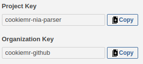

# Publish Analytics from local Maven to SonarCloud

Statistics about a project can help improve its quality, fix bugs even before merging code into `master` branch, especialy when an analytic tool can also check for known bad-practices, known bugs, readibility, and many more. Most popular approach is to run such analytics along with a pipeline. E.g. consider a git branch with unfinished code where a developer wants to fix quality before proceeding with a merge into poduction branch.

***Such setup of publishing code statistics to SonarCloud from a private repository will expose whole code in that repository***, so if a project should stay private, consider [paid subscriptions](https://sonarcloud.io/pricing).

## Setting Up Maven to run Sonar Goal Locally

To configure Maven, two things needs to be set up.
1. Maven `pom.xml` needs to be updated.
2. A local enviroment variable `SONAR_TOKEN` needs to be set.

### Maven Configuration

The following code should be added to the `pom.xml` file:

```xml
<properties>
    <sonar.host.url>https://sonarcloud.io</sonar.host.url>
    <sonar.organization>my_organization</sonar.organization>
    <sonar.projectKey>my_project</sonar.projectKey>
</properties>
```

Where:

 * `sonar.host.url` is the URL to SonarCould (which is already set to 
   proper value),
 * `sonar.organization` is the organization to which a project belongs to
    and a user who runs this analytics report goal needs to belong to,
 * `sonar.projectKey` is a key of a project, which can be chosen arbitrary.

These two last ones (`sonar.projectKey` & `sonar.organization`) will show
up on SonarCloud Report on right pane, next to badges section.

The `project-key` can be changed later, but such aciton will make SonarCloud to publish new reports as it would be a new (separate) project.



### Setting Enviromental Variable

The second thing that needs to be configured is an environmet variable named `SONAR_TOKEN`. While logged in to SonarCloud go to top-right corner to your profile and select `Profile → My Account → Security` (or follow [this link](https://sonarcloud.io/account/security/)). On the presented page configure new access token that will be used by local Maven. On the following picture a new token to be used on a local machine was created and is named `local-token`.

This is the only time that this secret token is presented to the user. So ***copy-paste this token*** and save it in some secured file on a local machine.


To set an enviromentar variable run either of following commands in a terminal (or command prompt):

Linux/Unix/MacOS:

```bash
export SONAR_TOKEN=xxx
```

Windows:

```cmd
set SONAR_TOKEN "xxx"
```

If this environment variable is not set, then the Sonar Plugin will report a `MojoExecutionException → NullPointerException`. Each new instance of a terminal (or a command prompt) needs this environment variable to be set.

## Running Maven

After `install` goal in Maven is run, statistics are avaliable for Sonar plugin. By default statistics will be presented in SonarCloud as it were for `master` branch. To specify other branch a parameter `sonar.branch.name` should be used. Running following Maven commands will publish these statistics to SonarCloud:

```bash
mvn clean install 
mvn org.sonarsource.scanner.maven:sonar-maven-plugin:sonar -Dsonar.branch.name=not_master
```

Or as one short command for branch `not_master`:

```bash
mvn clean install sonar:sonar -Dsonar.branch.name=not_master
```

Or the same as above command but for `master` branch (regardless of actual checkout branch on local git):

```bash
mvn clean install sonar:sonar
```

The result statistics will be presented on SonarCloud Report for the project.


## Secure Handling of Tokens

***Do not store token in a code***. Neither as an open text nor as an encrypted value. This would be a security breach. It can be easly obtained and your SonarCloud report page can be polluted by malicious agent.

***Never ever*** share your username/password with other developers and/or tools (e.g. Maven or Sonar Plugin) nor store it in your code, but rather use such tokens. Tokens can be invalidated and changed (rotated) when a security breach is identified (or just after specified period of time to prevent a security breach). Changing single token is better than changing all tokens along with an account's password for an account that was hacked by a malicious black hat.

# Code Coverage with JaCoCo

So far a SonarCloud report does not contain any information about the code coverage. This is because there is no code coverage report being generated. ***Code coverage reports expose code***, so if a project should stay private, consider [paid subscriptions](https://sonarcloud.io/pricing).

## Maven POM Updates

To generate a coverage report file, add a maven configuration into the `pom.xml` for the `jacoco-maven-plugin` plugin and bind its `report` goal to the Maven `verify` phase.

```xml
<build>
    <plugins>
        <plugin>
            <groupId>org.jacoco</groupId>
            <artifactId>jacoco-maven-plugin</artifactId>
            <version>0.8.5</version>
            <executions>
                <execution>
                    <id>report</id>
                    <goals>
                        <goal>report</goal>
                    </goals>
                    <phase>verify</phase>
                </execution>
            </executions>
        </plugin>
    </plugins>
 </build>
```

## Running Maven

To run JaCoCo plugin execute the following Maven commands (in that specific order):

```bash
mvn clean
mvn org.jacoco:jacoco-maven-plugin:prepare-agent
mvn verify
mvn sonar:sonar -Dsonar.branch.name=not_master
```

Or as just one command:

```bash
mvn clean jacoco:prepare-agent verify sonar:sonar -Dsonar.branch.name=not_master
```

The order of commands is very important here. Otherwise a code coverage report won't be presented by SonarCloud.

1. `clean` deletes `target` directory and all remnants of previous runs,
2. `jacoco:prepare-agent` prepares a property pointing to the JaCoCo runtime agent that can be passed as a VM argument to the application under test,
3. `verify` runs tests during which JaCoCo runtime agent gathers coverate statistics,
4. `sonar:sonar -Dsonar.branch.name=not_master` takes prepared JaCoCo Report and publishes it to SonarCloud along with other gathered statistics for a specified branch (SonarCloud branch, which can have different name than actually checkout branch in a git repository).

On SonarCloud Report page for the chosen project code coverage statistics will be avaliable.


## Read More

 * [SonarScanner for Maven](https://sonarcloud.io/documentation/analysis/scan/sonarscanner-for-maven/)
